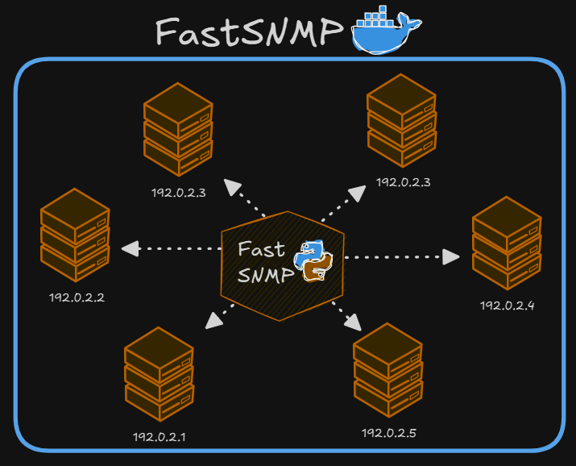

# Fast SNMP
*Fast SNMP* es un automatización especializada en proporcionar una API estable para la consulta SNMP a equipos de la red. Facilita la obtención de datos de los mismo para el distinto uso de dicha información.



---

**Tabla de Contenido**
- [Instalación](#Instalación)
  - [Requerimientos](#Requerimientos)
    - [Archivo de Configuración](#Archivo-de-Configuración)
  - [Entorno Virtual](#Entorno-Virtual)

---

# Instalación
## Requerimientos
Desarrollado en Python, se necesita tener instalado Python 3.13 o superior, además de una versión de Docker 28.3 o superior.

### Archivo de Configuración
Este mciroservicio puede realizar las consulta SNMP de forma remota o de manera local. Para poder determinar este tipo de configuración, es necesario crear un archivo de configuración en formato JSON llamado `ssh.production.json` con la siguiente estructura:

```json
{
  "localConnection": "false",
  "credentials": [
    {
      "user": "user",
      "password": "password",
      "host": "127.0.0.1",
      "port": 22
    }
  ],
  "commandPing": "ping",
  "commandSNMP": "snmpwalk"
}
```

> **Nota**: Si se especifica `localConnection` como `true`, el mciroservicio realizará las consultas SNMP de manera local. De lo contrario, se necesita especificar las credenciales de acceso a los equipos remotos. Si se especifican varias credenciales, el microservicio realizará un *SSH jump* para realizar las consultas en el último equipo de la lista.

# Makefile
El microservicio cuenta con un archivo `Makefile` para la instanciación rápia del contenedor:
```bash
make setup
```

Para iniciar el microservicio ejecute:
```bash
make start
```

También puedes detenerlo con:
```bash
make stop
```